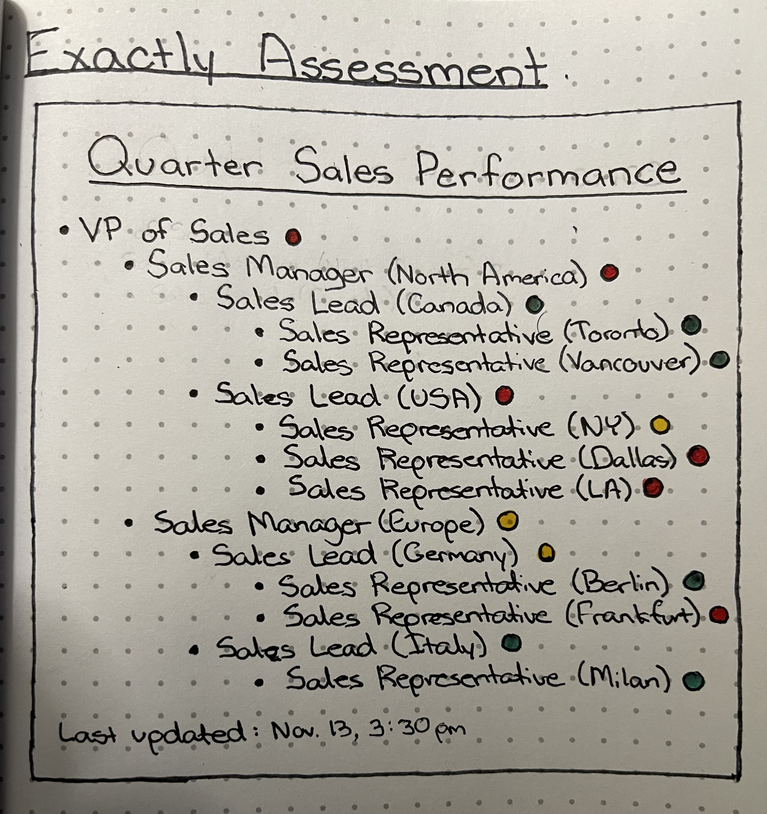

# Xactly Assessment

A technical assessment by Xactly on creating a reusable component for organizational hierarchy

## Diagrams



## Technologies Used
- React 
- Bootstrap
- Moment.js

## Available Scripts

After cloning this project, run:

```
npm install
```